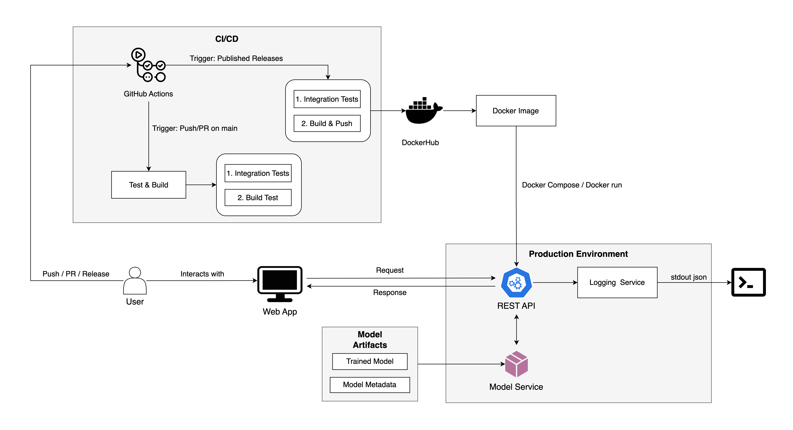
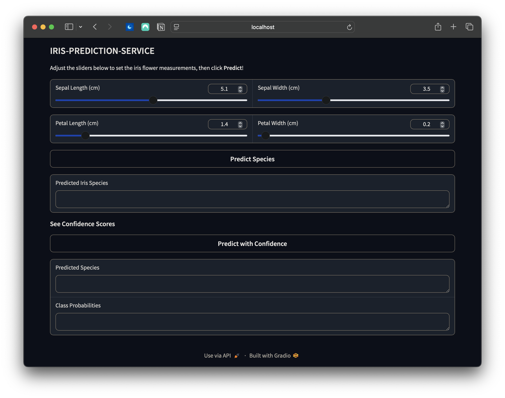

# Iris Species Prediction Service
A production-ready machine learning service that predicts Iris flower species using a RandomForest classifier. The service includes a REST API, a Gradio web interface, and comprehensive tests. The system is designed with production-grade features including structured JSON logging, health monitoring, and containerized deployment options. It implements best practices for ML serving including input validation, error handling, and batch predictions.

Below is the high level architecture diagram of the system:



## Table of Contents
- [System Architecture](#system-architecture)
- [Project Structure](#project-structure)
- [Module Descriptions](#module-descriptions)
  - [Core Modules](#core-modules)
  - [Testing Modules](#testing-modules)
- [CI/CD Pipeline](#cicd-pipeline)
- [Installation & Setup](#installation--setup)
- [Usage](#usage)
  - [Training the Model](#training-the-model)
  - [Running the API Server](#running-the-api-server)
  - [Running the Gradio Interface](#running-the-gradio-interface)
  - [Docker Deployment](#docker-deployment)
- [API Endpoints](#api-endpoints)
- [Testing](#testing)
- [Logging and Monitoring](#logging-and-monitoring)
- [Future Enhancements](#future-enhancements)

## Project Structure
```bash
iris-prediction-service/
├── src/
│   ├── __init__.py
│   ├── train.py            # Model training script
│   ├── serve.py            # Flask API server
│   ├── model_service.py    # Model inference service
│   ├── app.py      # Gradio web interface
│   ├── utils/
│   │   ├── __init__.py
│   │   └── logging_config.py
├── models/                 # Directory for saved models
│   ├── iris_model.joblib
│   └── iris_model_metadata.json
├── tests/                  # Tests for API and model
│   ├── __init__.py
│   ├── test_api.py         # API integration tests
│   └── test_model_service.py  # Model service unit tests
├── Dockerfile
├── docker-compose.yml
├── requirements.txt
└── README.md
```

## Module Descriptions

### Core Modules
- `train.py`: Trains a RandomForest classifier on the Iris dataset and saves both the model and its metadata
- `serve.py`: Implements a Flask REST API for model inference. It provides an API for performing inference. It includes endpoints for predicting Iris species (/predict), returning class probabilities (/predict-proba), and a health check (/health). The application validates inputs, logs requests, and handles errors while running a preloaded model service. Also logs prediction requests, errors, and model inference details using a structured logging system for monitoring and debugging.
- `model_service.py`: Defines the IrisModelService class, which loads a trained RandomForest model for the Iris dataset. It provides methods to predict class labels (predict) and return class probabilities (predict_proba) based on input feature vectors. 
- `app.py`: Provides a UI where users can input flower measurements via sliders and receive predictions from the API. The interface supports both single-label predictions and probability-based confidence scores.



### Testing Modules

- `test_api.py`: Holds integration tests validate the Flask API's endpoints by simulating real-world requests and checking responses. It uses pytest fixtures to create a temporary test model and a Flask test client for isolated testing. The tests cover valid and invalid input cases, boundary values, and API performance with large batches. Assertions are in place to verify correct responses, and error handling.


## CI/CD Pipeline

The project uses GitHub Actions for CI/CD. The pipeline includes:

- Testing with pytest
- Building and pushing the Docker image to Docker Hub

For modularity reason, each YAML file, `test-and-build.yml` and `publish.yml`, can focus on a specific task:

1. `test-and-build.yml`:
   - Triggered on every push or pull request to the `main` branch
   - Runs tests and builds the application
   - Verifies the Docker container works by testing the health endpoint

2. `publish.yml`:
   - Triggered when a release is published
   - Runs tests to ensure code quality
   - Only if tests pass, publishes the Docker image to Docker Hub with two tags:
     - `latest`
     - The specific release version

This dual-workflow setup ensures code quality at multiple stages:
- During development (via test-and-build.yml)
- Before publishing releases (via publish.yml)

The test requirements must pass in both workflows before any deployment or publishing can occur, maintaining consistent quality control throughout the pipeline.

## Installation & Setup

1. Clone the repository:
```bash
git clone git@github.com:syedayazsa/iris-prediction-service.git
cd iris-prediction-service
```

2. Create and activate a virtual environment:

   **Using venv:**
   ```bash
   python -m venv venv
   source venv/bin/activate  # On Windows: venv\Scripts\activate
   ```

   **Using Conda (Recommended):**
   ```bash
   conda create --name iris-env python=3.9.21
   conda activate iris-env
   ```

3. Install dependencies:

```bash
pip install -r requirements.txt
```

## Usage

### Training the Model

Train the model using default parameters:
```bash
python -m src.train
```

### Running the API Server

#### Local Development

```bash
python -m src.serve
```

#### Production (using Gunicorn)
In production, we prefer Gunicorn is preferred since HTTP server can handle multiple requests concurrently, which helps in performance and responsiveness. It also provides better management of worker processes, allowing for efficient resource utilization and improved fault tolerance.
```bash
gunicorn --bind 0.0.0.0:8000 src.serve:app
```

### Running the Gradio Interface
You can playaround with the sliders and receive predictions from the API via a web interface.

```bash
python -m src.app
```

### Docker Deployment

#### Local Docker Deployment

For simple local deployment with Docker:

1. Build the Docker image:
```bash
docker build -t iris-inference-server .
```

2. Run the Docker container:
```bash
docker run -p 8000:8000 \
  -e GUNICORN_WORKERS=4 \
  -e GUNICORN_THREADS=2 \
  -e FLASK_ENV=production \
  iris-inference-server
```

The container uses a Python 3.9 slim base image and runs the API server using Gunicorn with configurable workers and threads.

#### Production Deployment with Docker Compose

For production-like deployment using Docker Compose, which includes features like:
- Automatic container restart
- Health monitoring
- Log rotation
- Volume mounts for models and logs
- Environment variable configuration

1. Build and start the services:
```bash
docker compose up --build -d
```

2. Check the service status (includes health check results):
```bash
docker compose ps
```

3. View logs (JSON formatted with rotation):
```bash
docker compose logs -f iris-api
```

4. Scale the service horizontally (if needed):
```bash
docker compose up -d --scale iris-api=3
```

5. Stop the services:
```bash
docker compose down
```

#### Environment Configuration

The service can be configured using the following environment variables:

- `PORT`: The port on which the API server listens (default: 8000)
- `GUNICORN_WORKERS`: Number of Gunicorn worker processes (default: 4)
- `GUNICORN_THREADS`: Number of threads per worker (default: 2)
- `GUNICORN_TIMEOUT`: Worker timeout in seconds (default: 30)
- `FLASK_ENV`: Flask environment setting (production/development)
- `LOG_LEVEL`: Logging level (default: INFO)

You can override these in docker-compose.yml or pass them directly to docker run:
```bash
docker run -p 8000:8000 \
  -e GUNICORN_WORKERS=8 \
  -e LOG_LEVEL=DEBUG \
  iris-inference-server
```

#### Container Health Monitoring

The service includes automatic health monitoring that:
- Checks the `/health` endpoint every 30 seconds
- Allows 10 seconds for each health check
- Retries 3 times before marking unhealthy
- Waits 10 seconds before starting checks on container startup
- Automatically restarts unhealthy containers

## API Endpoints

The service provides three RESTful endpoints for model inference and health monitoring. All endpoints return JSON responses and include appropriate error handling.

### GET /health
Health check endpoint for monitoring the service status. Used by Docker for container health checks and general service monitoring.

**Sample Request:**
```bash
curl -X GET http://localhost:8000/health
```

**Response format:**
```json
{
    "status": "healthy",
    "timestamp": "2024-03-14T12:00:00.000Z",
    "service": "iris-prediction-api"
}
```

### POST /predict
Predicts Iris species for given measurements. Accepts single or batch predictions.

**Sample Request:**
```bash
# Single prediction
curl -X POST http://localhost:8000/predict \
  -H "Content-Type: application/json" \
  -d '{"input": [[5.1, 3.5, 1.4, 0.2]]}'

# Batch prediction
curl -X POST http://localhost:8000/predict \
  -H "Content-Type: application/json" \
  -d '{"input": [[5.1, 3.5, 1.4, 0.2], [6.2, 3.4, 5.4, 2.3]]}'
```

**Response format:**
```json
{
  "prediction": ["setosa"]  // Or multiple predictions for batch input
}
```

**Error Responses:**
- 400: Bad Request - Invalid input format (e.g., input is not a list)
- 415: Unsupported Media Type - Non-numeric features provided
- 422: Unprocessable Entity - Missing input data or wrong number of features (must be exactly 4)
- 500: Internal Server Error - Unexpected server-side errors during prediction

The error codes are chosen based on HTTP standards:
- 400 (Bad Request): Used when the request syntax is invalid
- 415 (Unsupported Media Type): Used when the input data format is not supported (non-numeric values)
- 422 (Unprocessable Entity): Used when the syntax is valid but the semantic validation fails
- 500 (Internal Server Error): Used for unexpected server-side errors

Each error response includes a JSON body with an "error" field containing a descriptive message:
```json
{
    "error": "Detailed error message explaining the issue"
}
```

### POST /predict-proba
Predicts Iris species with class probabilities for each input. Useful when confidence scores are needed.

**Sample Request:**
```bash
curl -X POST http://localhost:8000/predict-proba \
  -H "Content-Type: application/json" \
  -d '{"input": [[5.1, 3.5, 1.4, 0.2]]}'
```

**Response format:**
```json
{
  "prediction": ["setosa"],
  "probabilities": [
    [0.97, 0.02, 0.01]  // Probability for each class [setosa, versicolor, virginica]
  ]
}
```

## Testing
The project includes comprehensive integration tests that verify the API endpoints' functionality, error handling, and performance characteristics.

Run all tests:
```bash
pytest tests/
```

Run specific test files:
```bash
pytest tests/test_api.py
```

The test suite covers:
- **API Integration Tests**: Validates endpoint behavior with various inputs
- **Input Validation**: Tests handling of invalid, boundary, and malformed data
- **Batch Processing**: Verifies performance with large batches of predictions
- **Error Handling**: Ensures appropriate error responses for edge cases

### Run Tests with Coverage
To measure code coverage and generate a detailed report:
```bash
pytest --cov=src tests/
```

## Logging and Monitoring

### Logging

The service implements structured JSON logging using a custom logging configuration that captures detailed request metrics and application events. All logs are output to stdout in a consistent JSON format, making them easily parsable by log aggregation tools.

Each log entry is structured as a JSON object with consistent base fields:
```json
{
  "timestamp": "2024-03-14T12:00:00.000Z",
  "level": "INFO",
  "message": "Request completed",
  "request_metrics": {
    "endpoint": "/predict",
    "method": "POST",
    "status_code": 200,
    "latency_ms": 45.23,
    "request_id": "1234-5678",
    "error": null
  }
}
```

The logging system is implemented using Python's built-in logging module with following enhancements:

1. **Request Metrics Tracking**
   - Uses `@dataclass RequestMetrics` to ensure consistent metric structure
   - Tracks essential fields: endpoint, method, status_code, latency, request_id
   - Includes optional error field for exception tracking

2. **Custom JSON Formatter**
   - Implements a `JsonFormatter` class that formats logs as JSON
   - Automatically includes timestamp, log level, and message
   - Preserves additional context by including all non-internal attributes
   - Filters out internal Python logging attributes to keep logs clean

3. **Request Decorator**
   - `@log_request` decorator wraps API endpoints for automatic logging
   - Captures timing information for request latency calculation
   - Extracts request ID from headers (X-Request-ID) or generates one
   - Handles both successful requests and errors:
     - Logs 500 errors from unhandled exceptions
     - Captures 4xx errors from invalid requests
     - Records response status codes

4. **Error Handling**
   - Different log levels for different scenarios:
     - INFO: Normal request completion
     - ERROR: 4xx/5xx status codes or exceptions
   - Preserves error context in the logs
   - Maintains request traceability via request_id

All logs are written to stdout in JSON format, making them easy to collect and parse by container logging systems and log aggregation tools.

#### Monitoring System Integration

The JSON-structured logs from stdout can be integrated with modern monitoring and observability platforms. In a Kubernetes environment, these logs can be automatically collected by tools like Filebeat, which can parse the JSON structure and forward it to Elasticsearch. This would enable real-time visualization in Kibana, where one can creat dashboards tracking key metrics like endpoint latency distributions, error rates by status code, and request patterns identified by request_ids.

For metric-based monitoring with Prometheus, the service's structured logs can be processed by a log exporter that converts the JSON metrics into Promethus format. This approach allows tracking of request durations, status code distributions, and error rates. The request_id field enables trace sampling for detailed performance analysis, while the error context helps in identifying and debugging issues. Grafana dashboards can then visualize these metrics, which would be useful to look into specific requests using the request_id.

In cloud environments, the stdout JSON logs integrate naturally with services like AWS CloudWatch or Google Cloud Logging. These platforms can automatically parse the JSON structure, making fields like status_code, latency_ms, and error available for metric creation and alerting. The timestamp and request_id and structured error context would help in automated error detection and alerting.

The monitoring tool integration would allow use cases like anomaly detection based on latency patterns, error rate trending, and endpoint usage analytics. The logging system can be extended to be compatible with ML monitoring platforms that can track model performance and drift through the logged prediction metrics.

## Future Enhancements

### Advanced Orchestration and Scaling
The service could be enhanced with Kubernetes orchestration to provide more scaling and deployment capabilities. This would enable features like automatic horizontal pod scaling based on CPU/memory usage or custom metrics like request latency. Implementation of a service mesh (like Istio) could provide advanced traffic management, security policies, and detailed telemetry. For multi-region deployments, a global load balancer could direct traffic to the nearest healthy instance.

### Enhanced Security Features
Implementation of OAuth2/JWT authentication would enable fine-grained access control and user-specific rate limiting. API keys with different permission tiers could control access to specific endpoints or limit request volumes. Integration with vault services would provide secure storage and rotation of sensitive credentials. Network security could be enhanced through implementation of Web Application Firewall (WAF) rules for protecting against common attack vectors.

### Model Management and MLOps
A model registry could be implemented to track model versions, metadata, and performance metrics. This would enable A/B testing of different model versions and automatic rollback capabilities if performance degrades. Integration with ML monitoring tools could detect concept drift and trigger automated retraining pipelines. Implementation of feature stores would allow for consistent feature engineering across training and inference.

### API Enhancements
The API could be extended with batch processing optimizations for high-throughput scenarios, including async processing for large requests. API versioning could be implemented to ensure backward compatibility as the service evolves. Addition of a rate limiting service would protect against abuse while providing fair resource allocation among clients.

### Infrastructure Improvements
Infrastructure could be enhanced with multi-region deployment capabilities for improved global latency and disaster recovery.  Addition of automatic backup and restore capabilities would protect against data loss. Implementation of infrastructure as a code (IaaC) would ensure consistent environment provisioning.

### Caching and Performance
Implementation of a distributed caching layer (like Redis) could improve response times for frequent predictions. Edge caching through a CDN could reduce latency for global users. Query result caching could optimize repeated predictions. Implementation of request coalescing could reduce load during high-concurrency scenarios.

### Documentation and Developer Experience
The API documentation could be added as the ML Service gets more complex. Addition of performance benchmarking tools would help understand scaling characteristics.

